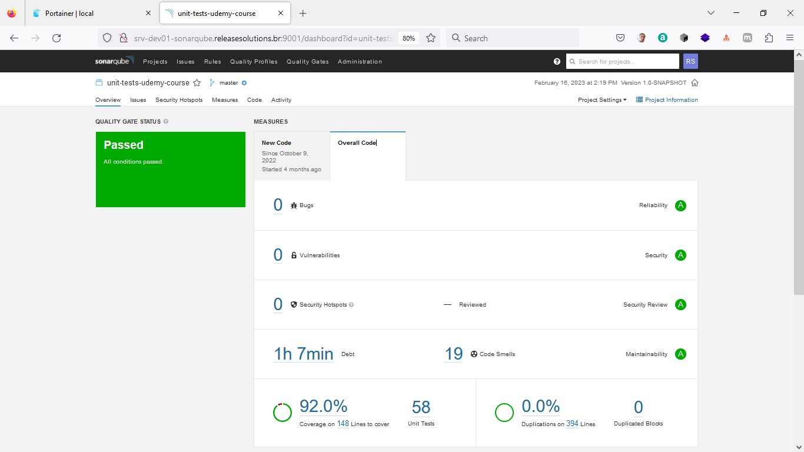

# Course: Unit Testing in Java: JUnit, Mockito, PowerMock and TDD

#### Os tópicos abordados nesse curso incluem:

• criação de uma bateria de testes unitários a partir do zero\
• criação do projeto e evolução do mesmo a partir de uma bateria de testes unitários de regressão\
• isolamento dos métodos de teste de dependências externas, definição de comportamento dos métodos e validação de
interações\
• aplicação do básico de Test Driven Development (TDD)\
• criação de métricas de qualidade a partir dos testes (percentual de aceitação e cobertura de código\
• criação de builders de objetos para centralizar a criação de entidades\
• adição de testes unitários em projetos legados

**Tecnologias utilizadas nesse projeto:** Java | JUnit4 | Git |SonarQube | Jacoco | Mockito | PowerMock | Maven |
Surefire

|           **Name**            |           **Github**            |  **Role**  |
|:-----------------------------:|:-------------------------------:|:----------:|
| Francisco Wagner Costa Aquino |   htts://github.com/wcaquino    | Instructor |
|         Robson Sousa          | https://github.com/robsoncartes |  Student   |

Link para o curso: https://www.udemy.com/course/testes-unitarios-em-java/

\
\

*Social Networking*

- [LinkedIn](https://www.linkedin.com/in/releasesolutions/)
- [Facebook](https://www.facebook.com/robsoncartes/)
- [Twitter](https://twitter.com/robson_cartes)
- [Instagram](https://www.instagram.com/robsoncartes/)
- [Youtube](https://www.youtube.com/robsoncartes)

